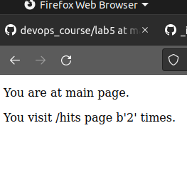
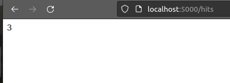
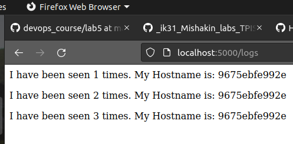
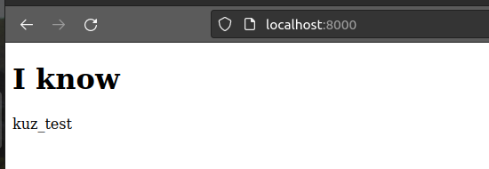

## Lab_5: Автоматизація за допомогою Makefile VS Docker Compose

1. Прочитав про `docker-compose` за [посиланням](https://docs.docker.com/compose/);
2. Прочитати про бібліотеку `Flask`за [посиланням](https://flask-russian-docs.readthedocs.io/ru/latest/quickstart.html);
3. За допомогою Docker автоматизував розгортання веб сайту з усіма супутніми процесами. Це зробив двома шляхами:
    - за допомогою `Makefile`;
    - за допомогою `docker-compose.yaml`;
4. Першим розглянемо варіант з `Makefile`, для цього створив робочий проект.
5. Створив папку `my_app` в якій знаходититься проект. Створив папку `tests` де є тести на перевірку працездатності
   проекту. Скопіюйвав файли з цього репозиторію викладача у відповідні папки мого. Ознайомився із вмістом кожного з
   файлів. Звернув увагу на файл `requirements.txt` у папці проекту та тестах. Даний файл містить залежності для нашого
   проекту
6. Cпробував чи проект є працездатним перейшовши у папку та після ініціалізації середовища та виконав команди записані
   нижче:
    ```bash
    pipenv --python 3.7
    pipenv install -r requirements.txt
    pipenv run python app.py
    ```
    - так само ініціалузував середовище для тестів у іншій вкладці шелу та запустив їх командою (вкажіть чи тести
      пройшли успішно?):ні не успішно
    ```bash
    pipenv run pytest test_app.py --url http://localhost:5000
    ```
    - автоматично створились файли `Pipfile` та `Pipfile.lock`, а також на хост машині папка `.venv` (вона може бути у
      home папці). Після зупинки проекту *ВИДАЛИВ ЇХ, і НЕ комітив*;
    - перевірив роботу сайту перейшовши на кожну із сторінок (в програмі `app.py`).
7. _Видалив файли які постворювались після тестового запуску_. Створив два `Dockerfile` з іменами як у цьому репозиторію
   викладача та `Makefile` який допоможе автоматизувати процес розгортання;
8. Ознайомився із вмістом `Dockerfile` та `Makefile` та його директивами. Розпишіть у Вашому `README.md` файлі що робить
   кожна директива `Makefile`;(добавив коментарі в мейкфайл)
9. Використовуючи команду `make .PHONY` створіть Docker імеджі для додатку та для тестів. Теги для цих імеджів є з моїм
   Docker Hub репозиторієм. Запустив додаток та перейшовши в іншу вкладку шелу запустіть тести за допомогою
   команд `make run` та `make test-app` Тести пройшли успішно;
    - перевірив роботу веб-сайту. Що відображається на кожній сторінці сайту (зробіть скріни сторінок та вставте до
      Вашого репозиторію)?

   

   

   

10. Зупинив проект натиснувши `Ctrl+C` та почистив всі ресурси Docker за допомогою `make docker-prune`.
11. Створив директиву в `Makefile` для завантаження створених імеджів у Ваш Docker Hub репозиторій. Завантажив імеджі до
    Вашого репозиторію;
12. Видаліть створені та закачані імеджі. Команда `docker images` має виводить пусті рядки. Створив директиву
    в `Makefile` яка автоматизує процес видалення Ваших імеджів.
13. Варіант з використанням `docker-compose.yaml`. Для цього створив даний файл у кореновій папці проекту та заповніть
    вмістом з прикладу.
14. Перевірив чи Docker-compose встановлений та працює у Вашій системі, а далі запустив `docker-compose`;
    ```bash
    docker-compose version
    docker-compose -p lab5 up
    ```
15. Перевірив чи працює веб-сайт. На яку адресу потрібнр зайти у браузері?local localhost:80
16. Перевірив чи компоуз створив докер імеджі (які Ви мали видалити перед цим). Які теги мають імеджі? Я отразу поміняв
    на свій репозиторій
17. Зупинив проект натиснувши `Ctrl+C` і почистив ресурси створені компоуз `docker-compose down`;
18. Завантажте створені імеджі до [Docker Hub](https://hub.docker.com/repository/docker/vitaliykuz/lab5_bobas)
    репозиторієм за допомого команди:
    ```bash
    docker-compose push
    ```                                                   
19. Що на Вашу думку краще використовувати `Makefile` чи `docker-compose.yaml`? На мою думку краще використувавати
    `docker-compose.yaml` через простоту використання , більш простіші команди , та швидкість роботи
20. (Завдання) Оскільки Ви навчились створювати `docker-compose.yaml` у цій лабораторній то потрібно:
    - створити `docker-compose.yaml` для лабораторної №4. Компоуз повинен створити два імеджі для Django сайту та
      моніторингу, а також їх успішно запустити (зверніть увагу на мережу);
      сайт працює 
21. Після успішного виконання роботи відредагував Ваш персональний _README.md_ у цьому репозиторію та створив pull
    request.